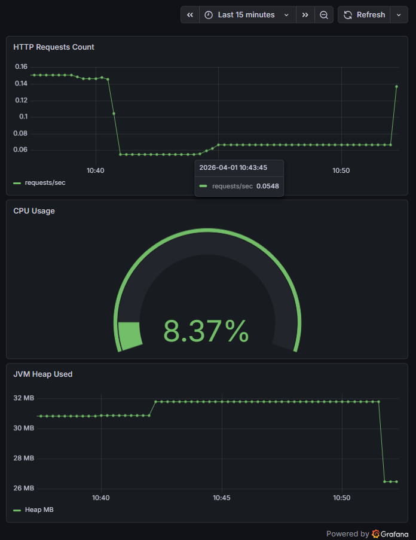

# Device Inventory API


## Live Demo

- Swagger UI: https://api.psharipov.de/swagger-ui/index.html
- Health: https://api.psharipov.de/actuator/health
- Protected API Endpoint (HTTP Basic Auth required): https://api.psharipov.de/api/v1/devices

## Demo-Zugang (nur lesend)

Swagger-Anfragen können mit folgenden Zugangsdaten getestet werden:

viewer / viewer-demo

## Repository Highlights

- Produktionsnah auf VPS deployt
- Containerisiert mit Docker (Spring Boot + PostgreSQL)
- Reverse Proxy via HTTPS
- Continuous Integration und automatisiertes Deployment mit GitHub Actions auf VPS

## Monitoring (Prometheus + Grafana)

Das Projekt enthält zusätzlich ein einfaches Monitoring-Setup mit Prometheus und Grafana.

Erfasste Beispielmetriken:
- HTTP Request Rate
- JVM Heap Usage
- CPU Usage

Grafana Dashboard:



## Kurzbeschreibung

REST-Backend zur Verwaltung von Netzwerkgeräten in einer IT-/Infrastruktur-Umgebung. Die API stellt CRUD-Endpunkte für Geräte bereit, validiert technische Eingaben (IPv4/IPv6), nutzt datenbankgestützte Migrationen und ist rollenbasiert abgesichert (Viewer/Admin). Das Projekt dient als technisches Portfolio-Projekt und orientiert sich an produktionsnahen Standards (Docker, PostgreSQL, Flyway, CI, Health Checks).

## Projektübersicht

**Was macht das Projekt?** 

Die Anwendung verwaltet Geräte (z. B. Router, Switches, Server) mit Hostname, IPv4/IPv6-Adresse, Status, Owner und Erstellzeitpunkt. Daten werden in PostgreSQL persistiert und per Flyway-Migrationen versioniert.

**API-Base-Path**

`/api/v1/devices`

**Domänenmodell (vereinfacht)**
- `hostname` (String)
- `ipv4Address` (String, eindeutig)
- `ipv6Address` (String, eindeutig)
- `status` (`IN_SERVICE`, `MAINTENANCE`, `DECOMMISSIONED`)
- `owner` (String)
- `createdAt` (automatisch beim Persistieren gesetzt)

## Ziel und praktischer Kontext

**Welches reale Problem wird gelöst?**

In IT-Betrieb/Netzwerkbetrieb müssen Geräteinventare nachvollziehbar gepflegt werden: Welche Geräte existieren? Welche IPs sind vergeben? In welchem Status befindet sich ein Gerät? Wer ist zuständig (Owner)? Dieses Projekt bildet diesen typischen Backend-Use-Case in einer klar strukturierten, wartbaren Spring-Architektur ab – inklusive Validierung, Datenbankmigration und Security.

## Technologien

**Backend & Build**
- Java 21
- Maven (inkl. Maven Wrapper `mvnw`)
- Spring Boot (3.x)

**Web & API**
- Spring Web (REST)
- Spring Validation (Jakarta Bean Validation)
- springdoc-openapi (Swagger UI / OpenAPI)

**Persistenz**
- Spring Data JPA
- PostgreSQL (Runtime)
- H2 (für Tests/isolierte Testkonfiguration)
- Flyway (Schema- und Datenmigrationen)

**Security & Betrieb**
- Spring Security (HTTP Basic Auth, Rollen)
- Spring Boot Actuator (Health/Info)

**Testing & Qualität**
- JUnit 5
- Mockito
- Spring Boot Test / WebMvcTest
- spring-security-test
- JaCoCo (Coverage-Report)

**CI**
- GitHub Actions Workflow (Build & Tests auf Push/PR `main`)

## Architektur

**Schichtenaufbau (klassische Spring-Schichtenarchitektur)**
- **Controller**: REST-Endpunkte, Request/Response-Verträge, HTTP-Statuscodes
- **Service**: Geschäftslogik, Transaktionen, Validations-/Konsistenzlogik
- **Repository**: Datenzugriff via `JpaRepository`
- **DTOs**: API-Verträge getrennt vom Persistenzmodell (`DeviceRequest`, `DeviceResponse`)
- **Mapper**: explizites Mapping zwischen DTO und Entity
- **Validation**: Bean Validation + Custom Constraints für IPv4/IPv6 und Kombinationen
- **Security**: zentrale Security-Konfiguration (rollenbasiert)
- **Exception Handling**: globales Error-Handling mit `ProblemDetail` (HTTP 404/400/409)

**Design-Entscheidungen (kurz)**
- Trennung von DTOs und Entity verbessert Wartbarkeit und stabilisiert den API-Vertrag.
- Flyway + `ddl-auto: validate` sorgt dafür, dass Schema-Änderungen versioniert sind und JPA das Schema nicht „heimlich“ verändert.
- Pagination via `Pageable` verhindert „unbounded“ Responses bei größeren Datenmengen.

## Funktionen

**API-Funktionalität**
- Geräte anlegen (POST)
- Geräte abrufen (GET, inkl. Pagination)
- Geräte nach `status` filtern (Query-Parameter)
- Gerät per ID abrufen (GET by id)
- Gerät aktualisieren (PUT)
- Gerät löschen (DELETE)

**Datenschutz & Datenqualität**
- Validierung technischer Eingaben:
  - IPv4- und IPv6-Validierung über Custom Validatoren
  - kombinierte Validierung (mindestens eine IP muss vorhanden sein)
- Doppelte IPs werden verhindert:
  - Repository-Prüfungen (`existsByIpv4Address`, `existsByIpv6Address`)
  - zusätzlich Datenbank-Constraints (Unique) als Sicherheitsnetz

**Operational Features**
- Health Check über Actuator
- API-Dokumentation über Swagger UI/OpenAPI
- Demo-Daten via Flyway-Migration (`V2__insert_demo_devices.sql`)

## Sicherheitskonzept, Konfiguration und Profile

**Authentifizierung**
- HTTP Basic Authentication (ideal für Demo/Service-to-Service, besonders in Kombination mit HTTPS)

**Autorisierung (Role-Based Access Control)**
- `VIEWER`: darf **lesen** (GET)
- `ADMIN`: darf **lesen und schreiben** (GET/POST/PUT/DELETE)

**Endpoint-Regeln (kompakt)**
- `GET /api/v1/devices/**` → `VIEWER` oder `ADMIN`
- `POST/PUT/DELETE /api/v1/devices/**` → `ADMIN`
- Swagger/OpenAPI ist öffentlich erreichbar (Endpunkte selbst bleiben geschützt)
- `actuator/health` und `actuator/info` sind öffentlich (typisch für Load Balancer / Monitoring)

**Secrets / Credentials**
- Demo-Credentials und Datenbankzugänge werden nicht im Repository gespeichert, sondern über Umgebungsvariablen gesetzt:
  - `ADMIN_PASSWORD`
  - `VIEWER_PASSWORD`
  - `POSTGRES_PASSWORD`
- Für Docker Compose werden diese Variablen über eine lokale `.env` Datei eingespeist (in `.gitignore`).

**Deployment Security**

- HTTPS-Termination erfolgt über Nginx Reverse Proxy
- Der Spring-Boot-Service ist nur lokal gebunden (`127.0.0.1:8080`) und nicht direkt öffentlich erreichbar
- UFW erlaubt ausschließlich Ports `22`, `80` und `443`
- Fail2ban schützt SSH vor Brute-Force-Angriffen
- Zusätzliche HTTP-Sicherheitsheader über Nginx konfiguriert
- Rate Limiting zum Schutz vor Request Flooding aktiviert
- TLS auf moderne Protokolle beschränkt (TLS 1.2 / 1.3)

**Profile (dev / docker / prod)**
- **Standardprofil (`application.yml`)**: Basiskonfiguration (Flyway aktiv, Actuator Exposure, Security-Properties)
- **dev (`application-dev.yml`)**: Datenquelle für Entwicklungsbetrieb (PostgreSQL)
- **docker (`application-docker.yml`)**: Datenquelle für Docker-Compose-Betrieb (`postgres` Service)
- **prod (`application-prod.yml`)**: Datenquelle für produktionsnahe Umgebung (Credentials via `DB_USER` / `DB_PASSWORD`)

Aktives Profil wird z. B. über `SPRING_PROFILES_ACTIVE` gesetzt (im Docker Setup ist das `docker`).

## Datenbank, Migration und Docker Deployment

**Datenbank**
- PostgreSQL (Docker Image: `postgres:16`)

**Migrationen**
- Flyway-Migrationen liegen unter:
  `src/main/resources/db/migration`
- Enthalten sind u. a.:
  - `V1__create_devices_table.sql` (Schema)
  - `V2__insert_demo_devices.sql` (Demo-Daten)

**Docker Setup**
- Multi-Stage Dockerfile:
  - Build mit Maven + JDK
  - Runtime mit schlankem JRE Image
- Docker Compose:
  - PostgreSQL mit persistentem Volume
  - App startet erst, wenn DB „healthy“ ist (Healthcheck + `depends_on`)

Start (lokal):
```bash
docker compose up -d --build
```

Stop:
```bash
docker compose down
```

Logs:
```bash
docker logs -f deviceinventory-app
```

## Lokaler Start, API-Doku, Tests und CI/CD

**Voraussetzungen**
- Java 21 (für lokalen Maven-Start)
- Docker + Docker Compose (empfohlen)
- Git

**Projekt klonen**
```bash
git clone https://github.com/pavel-sharipov/device-inventory-api.git
cd device-inventory-api
```

**Umgebungsvariablen setzen**
1) `.env.example` kopieren:
```bash
cp .env.example .env
```

2) Werte in `.env` setzen:
```text
ADMIN_PASSWORD=admin-demo
VIEWER_PASSWORD=viewer-demo
POSTGRES_PASSWORD=strong-postgres-password
```

**Start mit Docker (empfohlen)**
```bash
docker compose up -d --build
```

**Health Check**
```text
http://localhost:8080/actuator/health
```

**Swagger UI / OpenAPI**
```text
http://localhost:8080/swagger-ui/index.html
http://localhost:8080/v3/api-docs
```

**Beispielaufrufe (curl)**
- Alle Geräte lesen (Viewer):
```bash
curl -u viewer:viewer-demo "http://localhost:8080/api/v1/devices"
```

- Gerät anlegen (Admin):
```bash
curl -u admin:admin-demo -H "Content-Type: application/json" \
  -d '{"hostname":"router01","ipv4Address":"192.168.1.1","ipv6Address":"2001:db8::1","status":"IN_SERVICE","owner":"Max Mustermann"}' \
  "http://localhost:8080/api/v1/devices"
```

**Beispielantworten**

- Health Check:

```json
{"status":"UP"}
```

- Erfolgreiches Erstellen eines Geräts:
```json
{
  "id": 10,
  "hostname": "router01",
  "ipv4Address": "192.168.1.1",
  "ipv6Address": "2001:db8::1",
  "status": "IN_SERVICE",
  "owner": "Max Mustermann",
  "createdAt": "2026-03-31T07:59:22"
}
```


**Tests**
- Lokaler Testlauf:
```bash
./mvnw test
```

- Voller Verify-Lauf (inkl. Integration der Build-Pipeline-Checks):
```bash
./mvnw clean verify
```

- Coverage Report (JaCoCo):
```text
target/site/jacoco/index.html
```

**CI/CD (GitHub Actions)**
- Workflow wird auf `push` und `pull_request` gegen `main` ausgeführt.
- Schritte: Checkout → Java 21 Setup → Maven Wrapper → `./mvnw clean verify`
- Ziel: reproduzierbarer Build inkl. Testausführung in einer frischen Runner-Umgebung.
- Deployment erfolgt automatisch nur nach erfolgreichem CI-Lauf auf die VPS-Umgebung.

## Projektstatus und Bewerbungskontext

**Produktionsnahe Aspekte, die bereits umgesetzt sind**
- Versionierte DB-Migrationen (Flyway) statt „auto-ddl“
- Rollenbasierte Security-Konfiguration
- Fehlerbehandlung über zentralen Handler (konsistente HTTP-Responses)
- Containerisierung (Dockerfile + Compose) inkl. DB-Healthcheck
- CI-Pipeline für Build & Tests
- API-Dokumentation (Swagger UI/OpenAPI)
- Actuator Health Endpoint für Betrieb/Monitoring

**Sinnvolle Erweiterungen (realistische Next Steps)**
- Optionaler nächster Schritt: Secret Management über Docker Secrets oder Vault statt lokaler `.env`
- Integrationstests mit Testcontainers (PostgreSQL) für realistische DB-Tests
- Verbesserte Validierungskonsistenz (API-Validation ↔ DB-Constraints), z. B. verpflichtende IP-Felder oder Nullability-Alignment
- Observability: strukturierte Logs, Metrics, ggf. Prometheus/Grafana
- Optional: OpenAPI Security Scheme (Basic Auth) explizit im Swagger beschrieben

**Bewerbungskontext**
Dieses Projekt dient als Demonstration moderner Backend-Entwicklung mit Spring Boot in einem realistischen Setup. Es zeigt nicht nur CRUD, sondern auch Themen wie API-Verträge (DTO), Validierung, Fehlerbehandlung, Migrationen, Security, Containerisierung und CI – also Kompetenzen, die in typischen Java-Backend-Rollen (Deutschland) im Alltag erwartet werden.

## Technische Referenzen

Dieses Projekt basiert auf offiziellen Best Practices und Dokumentationen aus folgenden Quellen:

- [Spring Boot External Configuration](https://docs.spring.io/spring-boot/reference/features/external-config.html)
- [Spring Profiles](https://docs.spring.io/spring-boot/reference/features/profiles.html)
- [Spring Boot Actuator](https://docs.spring.io/spring-boot/actuator/endpoints.html)
- [Spring Security Basic Authentication](https://docs.spring.io/spring-security/reference/servlet/authentication/passwords/basic.html)
- [Docker Compose Environment Variables](https://docs.docker.com/compose/how-tos/environment-variables/variable-interpolation/)
- [Springdoc OpenAPI](https://springdoc.org/)
- [Flyway Baseline Strategy](https://documentation.red-gate.com/fd/flyway-baseline-on-migrate-setting-277578974.html)
- [GitHub Actions Setup Java](https://github.com/actions/setup-java)